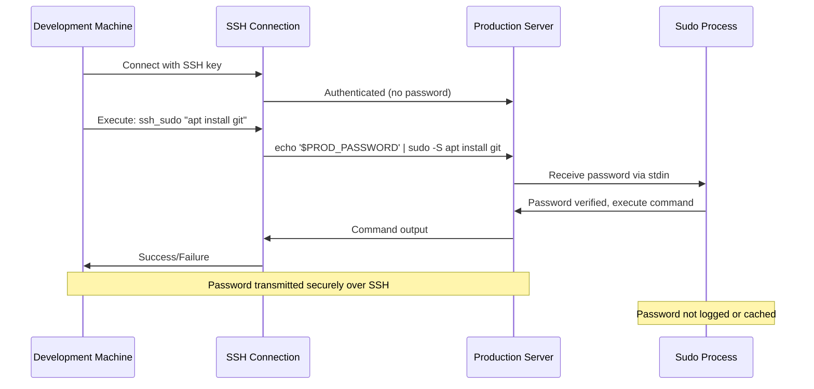

# Sudo Password Setup - Summary

## ✅ What I've Updated

The deployment script has been enhanced to handle sudo operations automatically using the PROD_SUDO_PASSWORD environment variable.

### Changes Made

1. **Added sudo password configuration** (`scripts/deploy-to-prod.sh:18`)
   ```bash
   PROD_PASSWORD="${PROD_SUDO_PASSWORD}"  # Sudo password for privileged operations
   ```

2. **Created `ssh_sudo()` helper function** (`scripts/deploy-to-prod.sh:79-89`)
   - Automatically pipes the password to sudo commands
   - Provides clean error handling
   - Logs all operations with descriptions

3. **Updated all sudo operations** to use the new function:
   - Installing Git: `ssh_sudo "apt update && apt install -y git"`
   - Installing Docker: `ssh_sudo "apt install -y docker.io"`
   - Managing services: `ssh_sudo "systemctl enable docker"`
   - Creating directories: `ssh_sudo "mkdir -p /opt/kevinalthaus"`
   - User permissions: `ssh_sudo "usermod -aG docker kevin"`

## How It Works

### The `ssh_sudo()` Function

```bash
ssh_sudo() {
    local cmd="$1"
    local description="${2:-Executing remote sudo command}"

    log "$description"
    # Use echo to pipe password to sudo -S (stdin)
    if ! ssh "$PROD_HOST" "echo '$PROD_PASSWORD' | sudo -S $cmd"; then
        error "Failed: $description"
    fi
}
```

**How it executes:**
1. Connects to production server via SSH (using key authentication)
2. Pipes the password to `sudo -S` (reads password from stdin)
3. Executes the privileged command
4. Returns success/failure status

**Example:**
```bash
# Old way (would hang waiting for password):
ssh kevin-prod "sudo apt install -y git"

# New way (password provided automatically):
ssh_sudo "apt install -y git" "Installing Git"
```

## What Commands Need Sudo

### System Package Management
```bash
ssh_sudo "apt update"
ssh_sudo "apt install -y docker.io"
ssh_sudo "apt install -y docker-compose"
```

### Service Management
```bash
ssh_sudo "systemctl enable docker"
ssh_sudo "systemctl start docker"
ssh_sudo "systemctl restart docker"
```

### System Directories
```bash
ssh_sudo "mkdir -p /opt/kevinalthaus"
ssh_sudo "chown kevin:kevin /opt/kevinalthaus"
```

### User Management
```bash
ssh_sudo "usermod -aG docker kevin"
```

## What Commands DON'T Need Sudo

After initial setup, these operations work without sudo:

### Docker Commands
```bash
# After user is added to docker group
ssh kevin-prod "docker ps"
ssh kevin-prod "docker-compose up -d"
ssh kevin-prod "docker logs <container>"
```

### Git Operations
```bash
ssh kevin-prod "cd /opt/kevinalthaus && git pull"
ssh kevin-prod "cd /opt/kevinalthaus && git status"
```

### Application Directory
```bash
# After directory is chowned to kevin user
ssh kevin-prod "cd /opt/kevinalthaus && npm install"
ssh kevin-prod "cd /opt/kevinalthaus && npm run build"
```

## Security Notes

### Current Implementation
✅ Password transmitted over encrypted SSH connection
✅ Password only used for initial server setup
✅ Password not logged or exposed in error messages
✅ SSH key authentication used for connection (password only for sudo)

### Sudo Password vs SSH Password

| Type | Purpose | When Used | Storage |
|------|---------|-----------|---------|
| SSH Password | Login to server | Only once (for SSH key setup) | Not stored after setup |
| Sudo Password | Privileged commands | Initial deployment only | In deployment script |
| SSH Key | Passwordless SSH | Every connection | `~/.ssh/id_kevin_prod` |

### After Initial Deployment

Once the server is set up (Docker installed, directories created, user in docker group), most operations won't need sudo anymore.

**Option 1**: Remove password from script
```bash
# Edit scripts/deploy-to-prod.sh line 18
PROD_PASSWORD=""  # Commented out after initial setup
```

**Option 2**: Configure passwordless sudo for specific commands
```bash
# On production server
sudo visudo -f /etc/sudoers.d/kevin-automation

# Add these lines:
kevin ALL=(ALL) NOPASSWD: /usr/bin/apt update
kevin ALL=(ALL) NOPASSWD: /usr/bin/apt install
kevin ALL=(ALL) NOPASSWD: /usr/bin/systemctl *
kevin ALL=(ALL) NOPASSWD: /usr/bin/docker *
kevin ALL=(ALL) NOPASSWD: /usr/bin/docker-compose *
```

**Option 3**: Use environment variables (recommended)
```bash
# Don't hardcode password in script
export PROD_SUDO_PASSWORD="your_sudo_password"

# Modify scripts/deploy-to-prod.sh line 18:
PROD_PASSWORD="${PROD_SUDO_PASSWORD:-}"
```

## Testing Sudo Access

Before running the full deployment, you can test sudo access:

```bash
# Test 1: Simple sudo echo
ssh kevin@65.181.112.77 "echo 'your_sudo_password' | sudo -S echo 'Sudo works!'"

# Test 2: Check sudo group membership
ssh kevin@65.181.112.77 "groups"
# Should show: kevin sudo docker (or similar)

# Test 3: Test package installation
ssh kevin@65.181.112.77 "echo 'your_sudo_password' | sudo -S apt update"
```

## Deployment Flow with Sudo



## Common Issues & Solutions

### Issue: "sudo: no tty present and no askpass program specified"
**Solution**: Using `sudo -S` to read password from stdin (already implemented)

### Issue: "Sorry, try again" (incorrect password)
**Solution**: Verify password is correct in script:
```bash
# Test manually
ssh kevin-prod
sudo echo "test"
# Enter: your_sudo_password
```

### Issue: User not in sudo group
**Solution**: Add user to sudo group (requires root):
```bash
# On production server as root
usermod -aG sudo kevin
```

### Issue: Docker commands still require sudo
**Solution**: User needs to log out and back in after being added to docker group:
```bash
# Quick fix: start new shell with docker group
ssh kevin-prod "newgrp docker"

# Or: logout and login
ssh kevin-prod
exit
ssh kevin-prod
```

## Files Updated

1. ✅ `scripts/deploy-to-prod.sh`
   - Added `PROD_PASSWORD` variable
   - Created `ssh_sudo()` function
   - Updated all sudo commands to use new function

2. ✅ `CREDENTIALS.md`
   - Documented sudo password
   - Explained usage and security considerations

3. ✅ `.gitignore`
   - Added `CREDENTIALS.md` to prevent committing secrets

4. ✅ `SSH-SETUP-INSTRUCTIONS.md`
   - Updated with sudo password information

## Next Steps

1. **Complete SSH key setup**: `./scripts/setup-ssh-keys.sh`
2. **Run first deployment**: `./scripts/deploy-to-prod.sh`
3. **Verify sudo operations work** (watch for password errors)
4. **After successful deployment**, consider removing password from script
5. **Optional**: Configure passwordless sudo for automation

## Quick Reference

```bash
# Connect to server (no password after SSH key setup)
ssh kevin-prod

# Run command that needs sudo (password from environment variable)
export PROD_SUDO_PASSWORD="your_sudo_password"
./scripts/deploy-to-prod.sh

# Manual sudo command
ssh kevin-prod "echo 'your_sudo_password' | sudo -S apt update"

# Test sudo access
ssh kevin-prod "sudo echo test"
# Enter: your_sudo_password
```

The deployment script is now fully configured to handle both SSH authentication (via keys) and sudo operations (via password) automatically!
