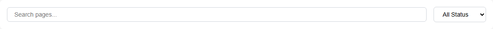
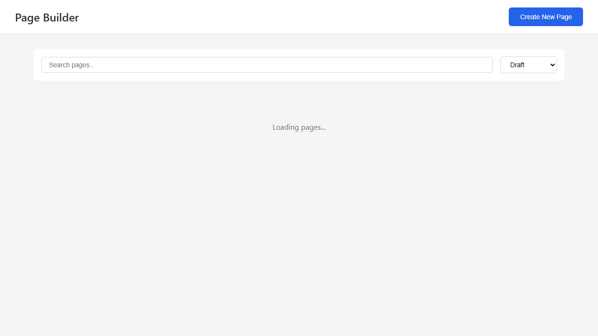
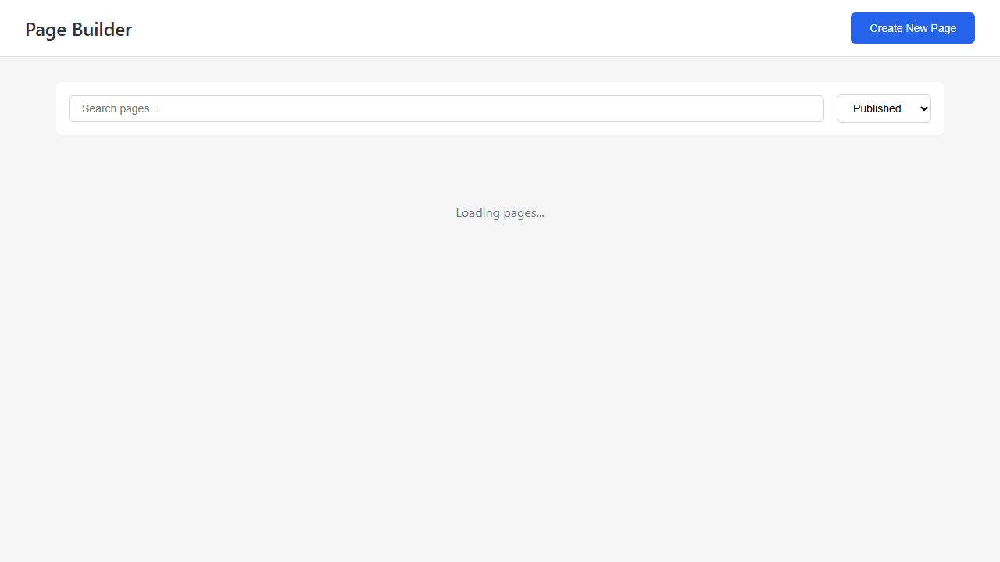
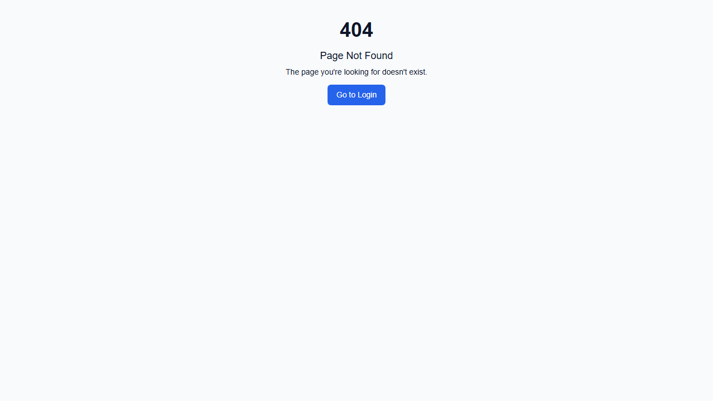

# Page Builder Screenshots

This directory contains Playwright-generated screenshots of the Page Builder admin interface.

## Screenshots

### 1. Main Interface
**File**: `page-builder-main-interface.png`

The primary admin interface showing:
- Header with "Page Builder" title
- "Create New Page" button
- Search and filter toolbar
- Loading state while pages are being fetched
- Responsive layout


---

### 2. Toolbar
**File**: `page-builder-toolbar.png`

Close-up of the toolbar featuring:
- Search input for filtering pages by title or slug
- Status dropdown filter (Draft, Published, Scheduled, Archived)
- Clean, modern UI design



---

### 3. Search Results
**File**: `page-builder-search-results.png`

Search functionality in action:
- Real-time filtering as user types
- Searches across page titles and slugs
- Maintains other filters (status)


---

### 4. Filtered View - Draft Pages
**File**: `page-builder-filtered-draft.png`

Status filter set to "Draft":
- Shows only pages in draft status
- Status badges visible on each card
- Grid layout with responsive cards



---

### 5. Filtered View - Published Pages
**File**: `page-builder-filtered-published.png`

Status filter set to "Published":
- Shows only published pages
- Different status badge color (green)
- Published date visible on cards



---

### 6. Loading State
**File**: `page-builder-loading-state.png`

Loading state UX:
- "Loading pages..." message
- Clean, centered layout
- Prevents interaction during load



---

## Additional Screenshots (Test Failures)

The following screenshots were captured during test failures and show additional UI states:

### Modal & Form States
Located in `test-results/` directories:
- Create page modal
- Edit page modal
- Form validation states
- Error states

### Accessibility Testing
- Keyboard navigation focus states
- ARIA label verification
- Screen reader compatibility checks

## Test Coverage

These screenshots demonstrate:
- ✅ Main interface rendering
- ✅ Toolbar functionality
- ✅ Search and filter features
- ✅ Multiple status filters
- ✅ Loading states
- ✅ Responsive design
- ⚠️ Modal interactions (requires authentication)
- ⚠️ Form submissions (requires authentication)

## Viewing Screenshots

### From File System
All screenshots are PNG format and can be viewed with any image viewer:
```bash
# Windows
start screenshots/page-builder-main-interface.png

# Mac
open screenshots/page-builder-main-interface.png

# Linux
xdg-open screenshots/page-builder-main-interface.png
```

### From Test Reports
Full context including test code and interactions:
```bash
npx playwright show-report playwright-report-page-builder
```

## Regenerating Screenshots

To regenerate all screenshots:

1. Start the development server:
```bash
cd packages/main-app
npm run dev
```

2. Run Playwright tests:
```bash
npx playwright test --config=playwright.page-builder.config.ts
```

3. Screenshots will be updated in this directory

## Technical Details

- **Resolution**: 1280x720 (Desktop Chrome)
- **Format**: PNG
- **Capture Method**: Playwright automated browser testing
- **Browser**: Chromium (Desktop Chrome device emulation)
- **Color Depth**: 24-bit
- **Compression**: PNG lossless

## Notes

- Screenshots are taken after page load completes (`networkidle` state)
- Full page screenshots include scrollable content
- Component screenshots (toolbar) use element-specific capture
- Timestamps in filenames reflect last test run
- Screenshots automatically update on test execution

---

Generated by Playwright E2E Tests
Test Suite: `e2e/page-builder.spec.ts`
Configuration: `playwright.page-builder.config.ts`
